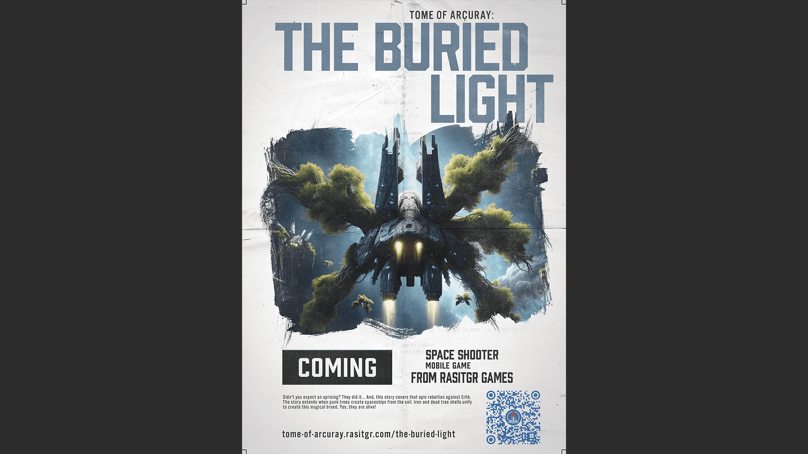
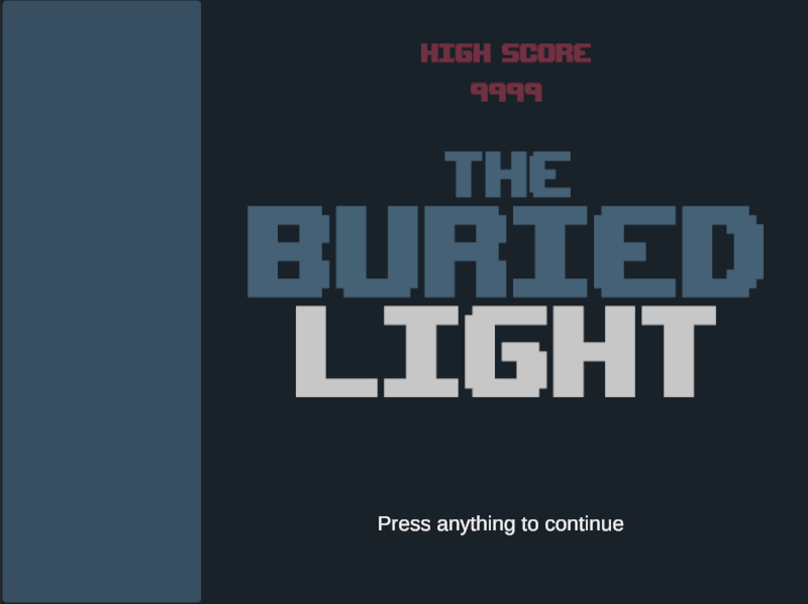

# **The Buried Light**

An **asteroids-like**, narrative-driven cross-platform Mobile and WebGL game.


---

## **Tech Stack**

- **Unity**: Version 2022.3.22f1  
- **Programming Language**: C#  
- **Dependency Injection**: Zenject  
- **Reactive Programming**: UniRx
- **Asynchronous Programming**: UniTask
- **Live Ops Integration**: Firebase

---

## **Project Status**

Current Stage: **Active Development**
The game is currently focused on developing the core game systems and implementing LiveOps features using Firebase for dynamic content updates, real-time events, and enhanced player engagement.



---

## **About The Game**

**The Buried Light** is an extension of the **transmedia narrative project** [Tome of Arçuray](https://tome-of-arcuray.rasitgr.com/). This game expands on the story of the **tree folk**'s rebellion against the oppressive reign of **Erlik**. Set in a visually rich universe, it blends classic arcade gameplay with a modern, narrative-driven twist.

---

## **Gameplay Mechanics**

- **Two-Axis Movement**: Navigate your spaceship freely while avoiding or engaging enemies.  
- **Shooting**: Defend yourself against enemy waves using precise projectile mechanics.  
- **Perk Progression**: Enhance your abilities through scalable upgrades as you progress.

---

## **LiveOps System Plan**

To support dynamic, real-time gameplay experiences, Firebase will be integrated as follows:

1. **Real-Time Database**: Manage event configurations, live leaderboards, and dynamic game states.
2. **Cloud Functions**: Automate scheduled events, reward distribution, and remote updates.
3. **Firebase Remote Config**: Enable on-the-fly adjustments to difficulty, rewards, and content without requiring app updates.
4. **Cloud Messaging**: Notify players of live events, updates, and limited-time offers.
5. **Analytics**: Monitor player behavior to optimize engagement and retention.

---

## **Design Guide/Goals**

- **Clean Code Principles**: Ensuring maintainable and readable code with a focus on modularity and scalability.
- **Zenject for Dependency Injection**: Promoting loose coupling and testable architecture, enabling easy integration of new systems.
- **Reactive Programming with UniRx**: Efficiently managing asynchronous event flows and complex game state interactions.
- **Optimized Asynchronous Programming**: Utilizing UniTask to handle background tasks, ensuring smooth performance during asset loading and data fetching.
- **Performance Optimization**: Utilizing Unity Profiler and best practices to reduce memory overhead and ensure stable FPS across platforms.
- **Dynamic Content Management**: Architected to support seamless LiveOps updates, including dynamic asset loading via Addressables.

---

## **Development Practices**

- **Modular Architecture**: Built using Zenject for dependency injection, promoting clean code and scalability.  
- **Reactive Programming**: UniRx is used for handling events and system communications, allowing for robust and maintainable code.  
- **Physics-based Movement**: Player movement uses Unity’s physics system for realistic momentum and drag.

---

## **Folder Structure**

The project is organized for maintainability and scalability:  
- **Scripts**  
  - **Data**: Scriptable Objects and Backend logic.  
  - **Gameplay**: Player, enemies, and mechanics logic.  
  - **Managers**: WaveManager, GameManager, and related managers.  
  - **Systems**: Event System, Sound System, Input System, and other standalone systems.
  - **Utilities**: Reusable generic scripts. 
- **AddressableAssets**
  - **Sounds**: Sound & music files
  - **Sprites**: 2D visuals
  - **Prefabs**: Prefabs & modular units
  - **Scriptable Objects**: Config files
- **Scenes**
- **Plugins**

---

## **Getting Started**

### Prerequisites:
- Install **Unity 2022.3.22f1** or later.  
- Ensure you have Git installed for version control.  

### Setup:
1. Clone this repository:  
   ```bash
   git clone https://github.com/pabron7/the-buried-light.git
   cd the-buried-light
2. Open the project in Unity.
3. Build and run the game for WebGL or any preferred platform.

### Contributions:
Contributions are welcome! Follow these steps:

* Fork the repository.
* Create a new branch: feature/YourFeatureName.
* Submit a pull request.

### LICENSE
This project is licensed under the [MIT License](LICENSE).

### CONTACT
For questions or suggestions, reach out at: krtalp@gmail.com
